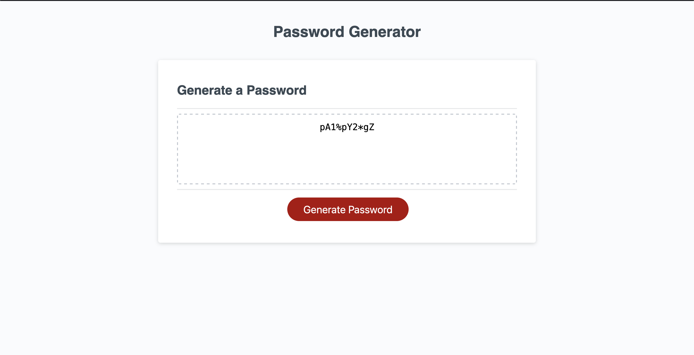

# JavaScript Password Generator

    

## Description

JavaScript password generator that allows users to select different character types and randomize them into a password of their desired length. Character options include:

- Lowercase letters
- Uppercase Letters
- Numbers
- Special Charaters

## Credits

Worked on as a project for UPENN's coding bootcamp under the instruction of Leif Hetland.